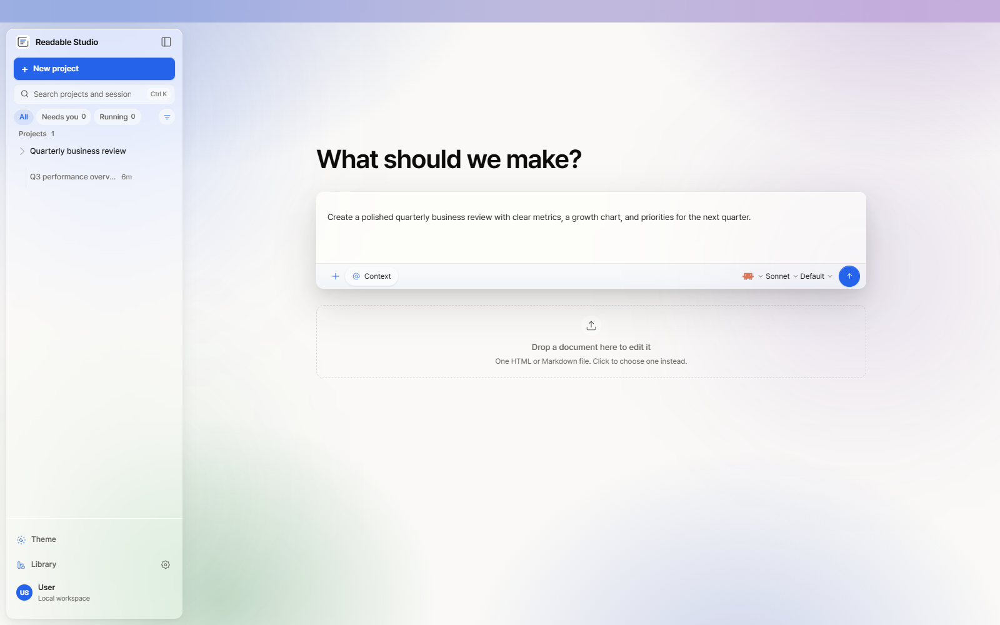
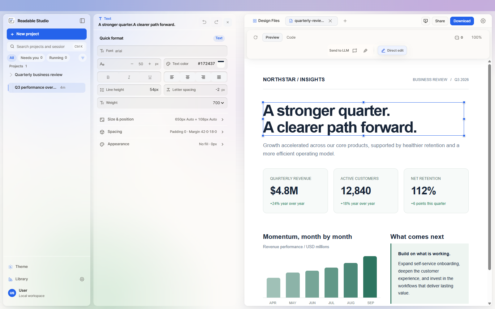
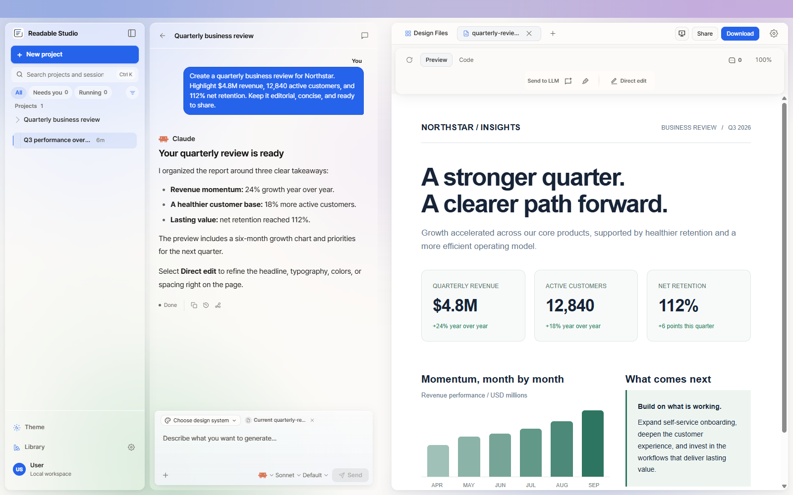
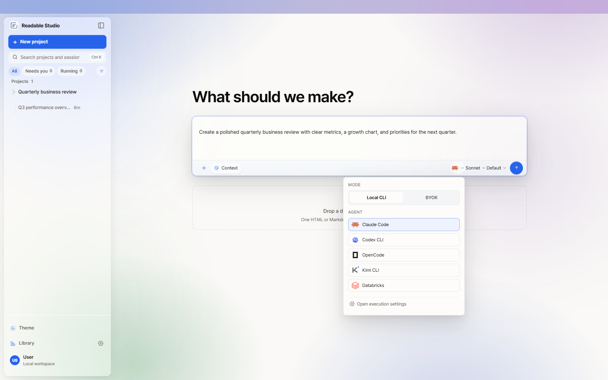
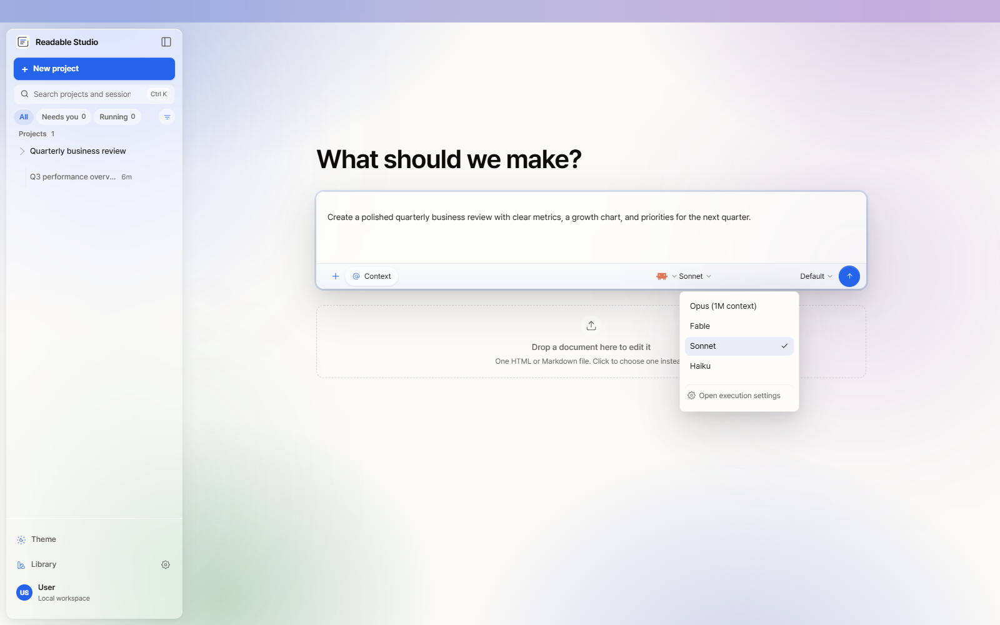
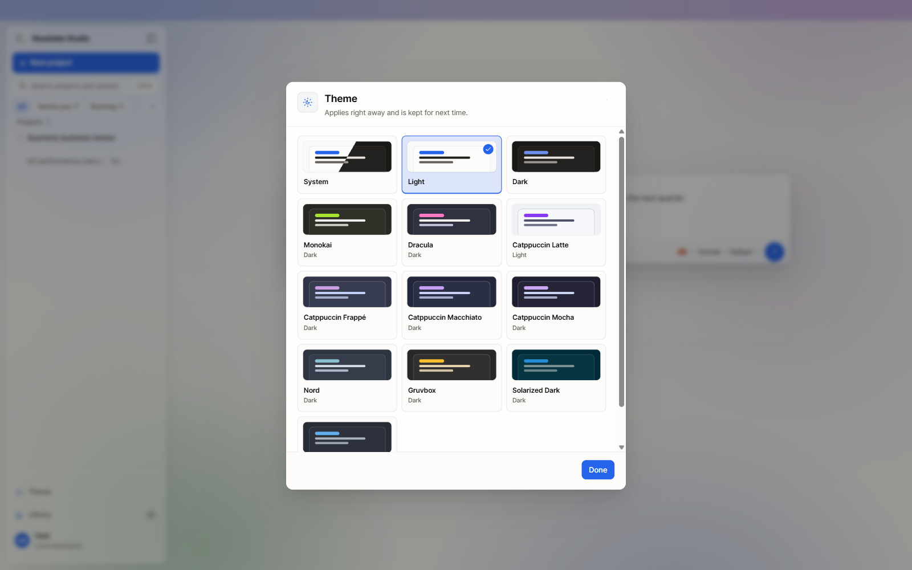
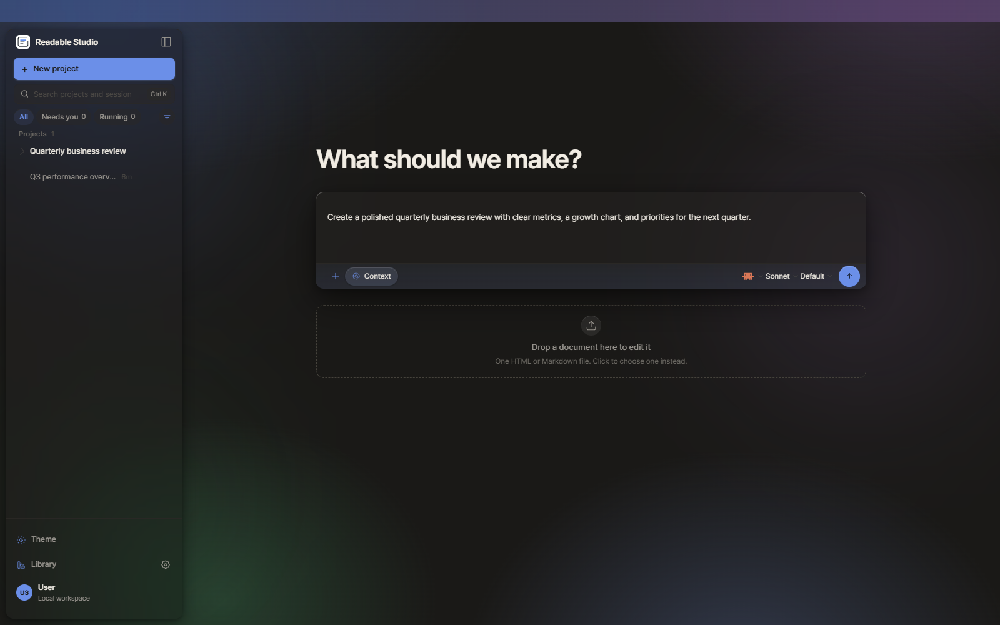
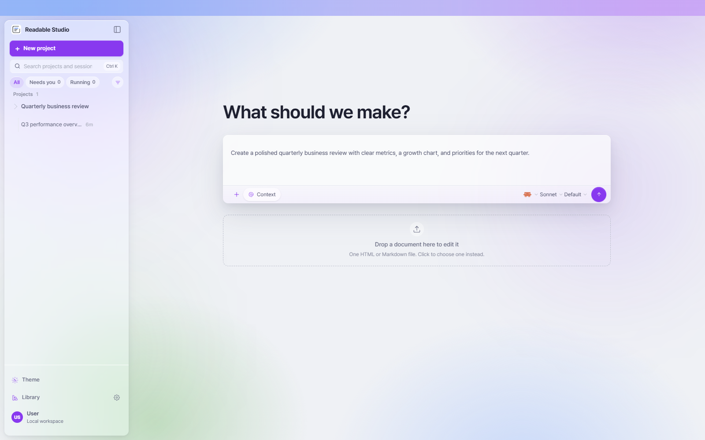
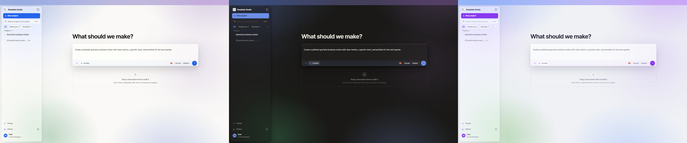

# Readable Studio

**Turn source text into polished standalone HTML, then edit it like a slide.**

Readable Studio is a Windows desktop workspace for office documents. Paste a brief, let a coding agent build the first draft, fix the details yourself in the preview, and hand off one self-contained HTML file.



## The problem

AI writes a good first draft. Then the heading is two words too long, a card needs to move, and a colour is off. Every fix means another prompt and another wait. Readable Studio ends that loop: generate once, then change what you see directly.

## How it works

```text
Source Text -> AI Generation -> Direct Editing -> Standalone HTML
```

1. **Source Text.** Paste the brief, report, or notes, or import a folder of approved material. The document is grounded in what you supply, not invented.
2. **AI Generation.** Pick a plugin, skill, and design system. Readable Studio composes them with your source and dispatches an installed local agent. The result renders in the Studio.
3. **Direct Editing.** Select any element in the preview and change it in place. Every edit writes back to the HTML source.
4. **Standalone HTML.** Export one file that opens anywhere. Local CSS, scripts, images, and fonts are inlined; anything unresolved is reported, not hidden.

## Direct editing



Click a headline and the inspector opens beside it. Drag the handles to resize. Nudge with the keyboard. Change the copy, the font, the weight, the spacing, the colour. Swap a link or an image. Every change is a patch against the canonical HTML source, so it survives export and stays readable to the next agent run.

What you can change without a prompt:

- text, including rich text selections
- links and images
- typography: family, size, weight, line height
- spacing, borders, and box model
- position and size, by drag or keyboard
- colours and design tokens
- attributes and the element's own HTML
- duplicate, move, remove, undo, redo

Direct editing sits beside the agent, not in place of it. Use the inspector for mechanical fixes. Use comments and prompts when the revision is substantive.

## Tour

**The workspace.** Conversation on one side, the rendered document on the other. Here, a seeded quarterly business review beside the run that produced it.



**Agents and models.** Pick an installed local agent, or switch to bring-your-own-key execution. Then choose the model for that agent.

| | |
| --- | --- |
|  |  |

## Themes and design systems

The app has twelve built-in themes plus a follow-system option, from Light and Dark to Catppuccin, Nord, Gruvbox, Dracula, and Solarized.



| Dark | Catppuccin Latte |
| --- | --- |
|  |  |



Documents draw from a separate library. The repository ships **150 design systems** under [`design-systems/`](design-systems), **99 design templates** under [`design-templates/`](design-templates), and **154 skills** under [`skills/`](skills). A design system sets the visual language of the generated document; a template sets its shape; a skill tells the agent how to work. Combine them per run or let a plugin choose.

## Install

Readable Studio ships as a **Windows 10/11 x64 portable ZIP**. Nothing to install.

1. Open [GitHub Releases](https://github.com/sanghyunna/readable-studio/releases).
2. Download the latest `Readable Studio-<namespace>-portable.zip`.
3. Extract the whole archive to a writable folder.
4. Run `Readable Studio.exe`.

The target machine doesn't need Node.js, pnpm, or Git. Don't launch the executable from inside the ZIP view. When you move the app, move the `ReadableStudioData` folder with it; that's where projects, settings, logs, and cache live. Windows may show a SmartScreen warning for an unsigned build; confirm the file came from the Releases page before running it.

For local-agent mode you need an installed, authenticated coding-agent CLI. Codex and Cursor Agent are scanned by default. Other installed adapters can be enabled in Settings.

## First document

1. Create a project.
2. Paste the source text. State the audience and the purpose.
3. Choose an agent, and a plugin, skill, or design system if the defaults don't fit.
4. Generate.
5. Open **Edit**, select anything in the preview, and revise it in place.
6. **Export as standalone HTML**.

A request that works well:

> Turn this source into a concise quarterly operating review for department leads. Preserve all figures and approved terms. Use clear sections and scannable tables. Prepare the result for direct editing and standalone HTML export.

## Agents, models, and the CLI

The UI and the `readable` CLI talk to the same local daemon through the same `/api/*` contracts. Every capability in the UI has a subcommand. Machine-consumed commands support `--json`; commands that take a prompt accept `--prompt-file <path|->`.

```powershell
readable project create --name "Quarterly review" --json
readable files list --project <project-id> --json
readable plugin search "report" --json
readable plugin apply <plugin-id> --project <project-id> --input brief="..."
readable design-systems list --json
readable export html --project <project-id> --file index.html --output .\quarterly-review.html --json
```

Subcommands also cover `run`, `conversation`, `artifacts`, `skills`, `templates`, `automation`, `research`, `memory`, `mcp`, `ui`, `agent`, `provider`, `fonts`, `doctor`, and more. Run `readable --help` for the full set.

Plugins are portable workflow folders: `SKILL.md` for the agent, plus an optional `readable-studio.json` for typed inputs, capabilities, stages, and references. See [`docs/plugins-spec.md`](docs/plugins-spec.md).

## Exports

Standalone HTML is the canonical output. Other formats depend on the artifact:

| Artifact | Exports |
| --- | --- |
| HTML document | standalone HTML, PDF, ZIP |
| Slide deck | standalone HTML, PDF, PPTX, ZIP |
| Markdown document | Markdown, HTML, PDF, ZIP |
| SVG | SVG, ZIP |

The HTML exporter inlines statically discoverable local dependencies. External URLs and missing local files stay in place and surface as warnings. It doesn't crawl websites or capture runtime network traffic.

## Data locations

| Mode | Location |
| --- | --- |
| Portable app | `<exeDir>\ReadableStudioData\namespaces\<namespace>\...` |
| Source checkout | `<repo>\.readable-studio\...` |
| Override | absolute path in `READABLE_DATA_DIR` |

## Develop from source

This section is for contributors. Product users should use the portable ZIP above.

Requirements: Windows 10/11 x64, Node `~24`, pnpm `10.33.2`, Visual Studio Build Tools 2022 or newer, and Python 3 for the native `better-sqlite3` build.

```powershell
git clone https://github.com/sanghyunna/readable-studio.git
cd readable-studio
npm install -g pnpm@10.33.2
pnpm install
pnpm tools-dev
```

`pnpm tools-dev` is the only root lifecycle command. There's no root `pnpm dev`, `start`, `build`, or `test`. Use `pnpm tools-dev status --json`, `logs --json`, `stop`, and `check` to control the workspace. Before opening a PR, run `pnpm guard` and `pnpm typecheck`.

Build the portable ZIP from the repository root:

```powershell
powershell -ExecutionPolicy Bypass -File .\build-portable.ps1
```

Maintainers can build, start, inspect, and tear down a local portable build with `pnpm tools-pack win <build|start|inspect|logs|stop|cleanup>`. These are local controls; the repository has no release-publishing workflow.

```text
Windows desktop shell
        |
        v
Next.js web UI  <---- /api/* + SSE ---->  local daemon  ----> enabled agent CLI
     |                                      |
     |                                      +---- plugins / skills / design systems
     v                                      +---- .readable-studio data
sandboxed preview + direct-edit bridge
     |
     +---- standalone HTML (canonical)
     +---- PDF / PPTX / ZIP / Markdown (artifact-dependent)
```

Read [`QUICKSTART.md`](QUICKSTART.md), [`docs/architecture.md`](docs/architecture.md), [`docs/spec.md`](docs/spec.md), and [`CONTRIBUTING.md`](CONTRIBUTING.md). English and Korean are the maintained product languages; see [`TRANSLATIONS.md`](TRANSLATIONS.md).

## License

See [`LICENSE`](LICENSE).
