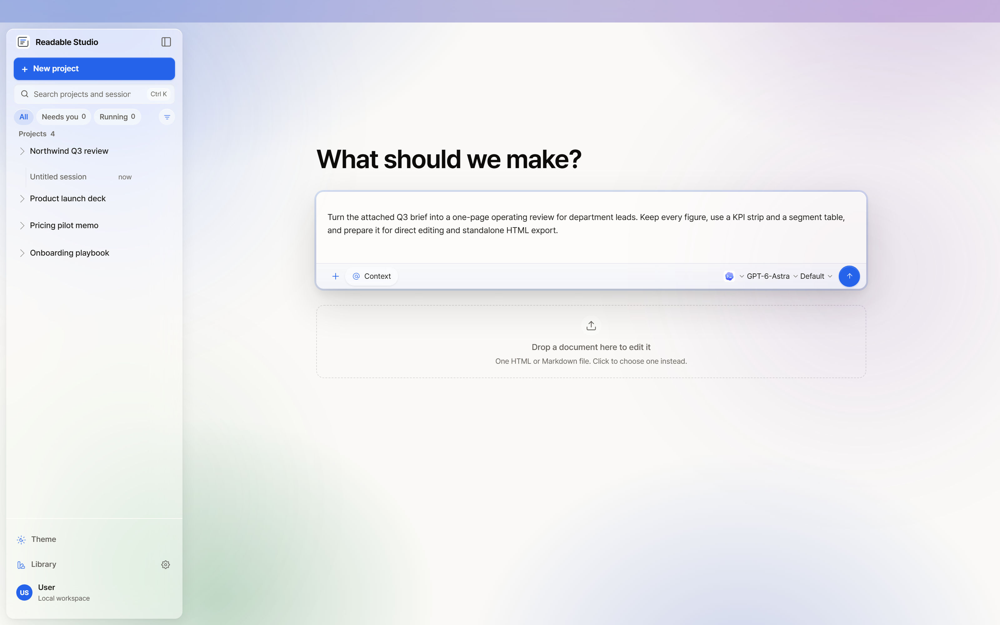
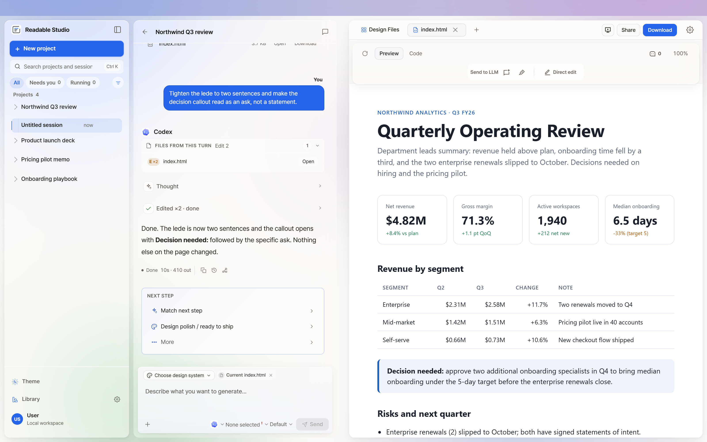
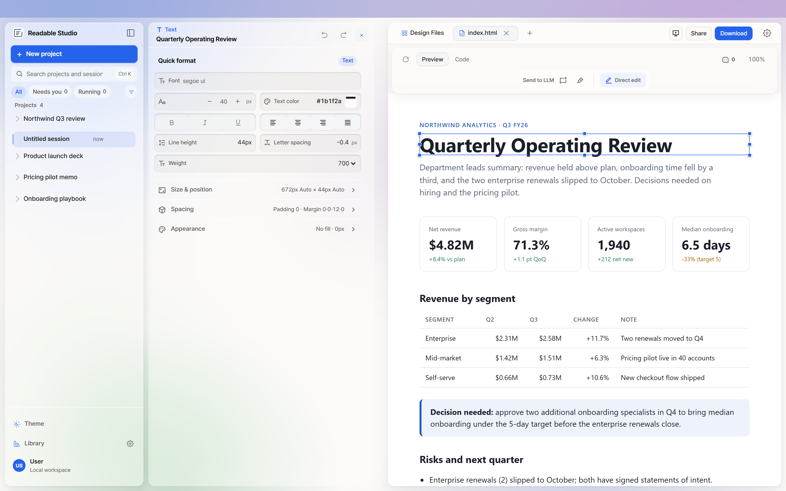
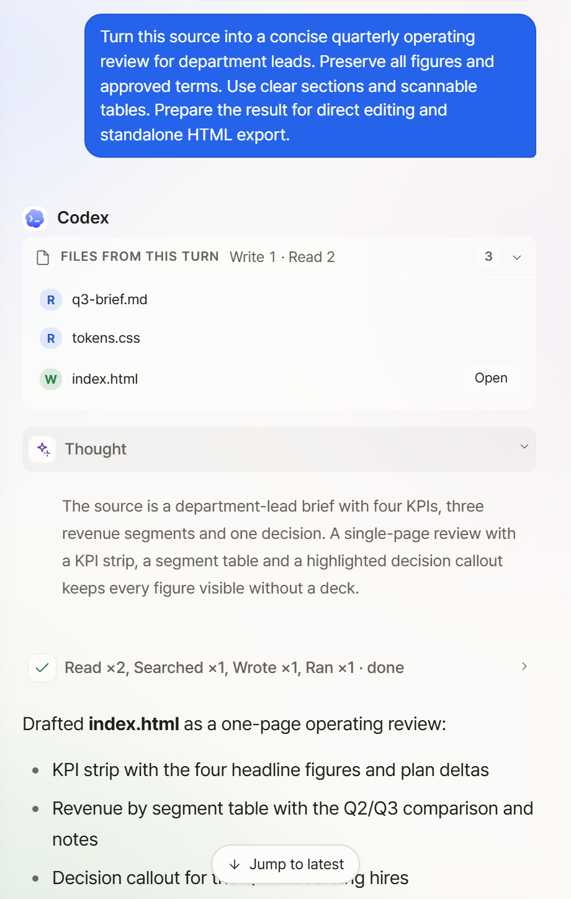
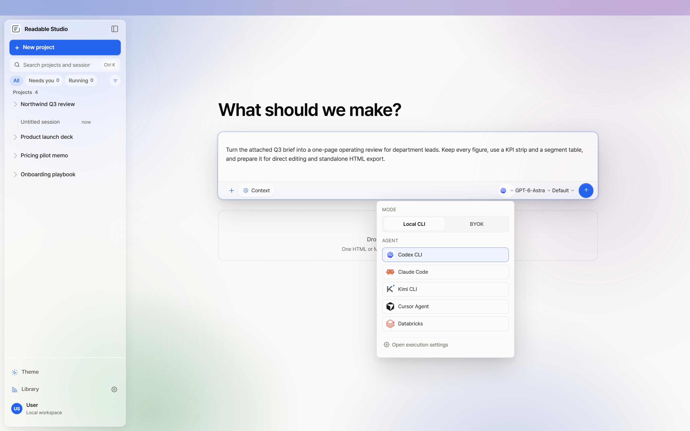
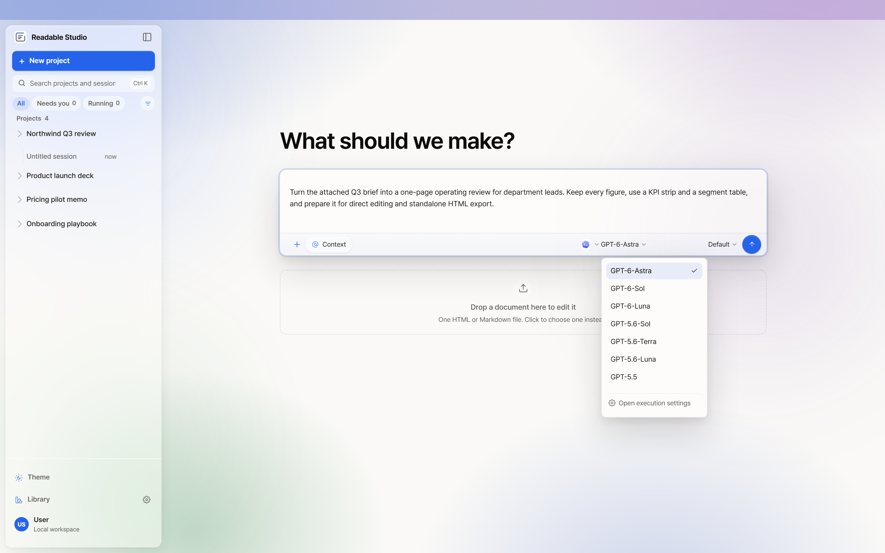
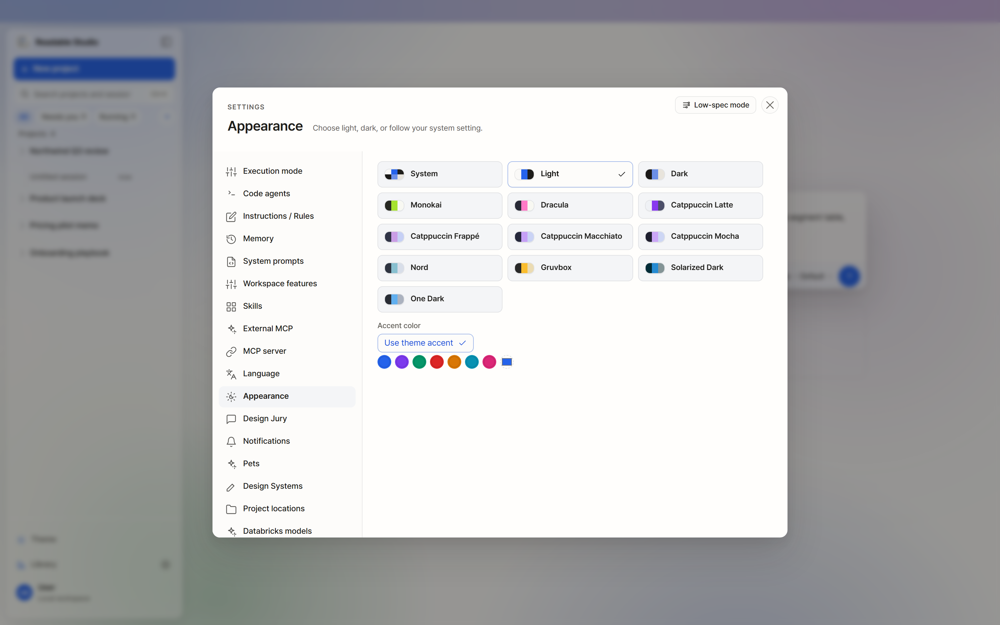
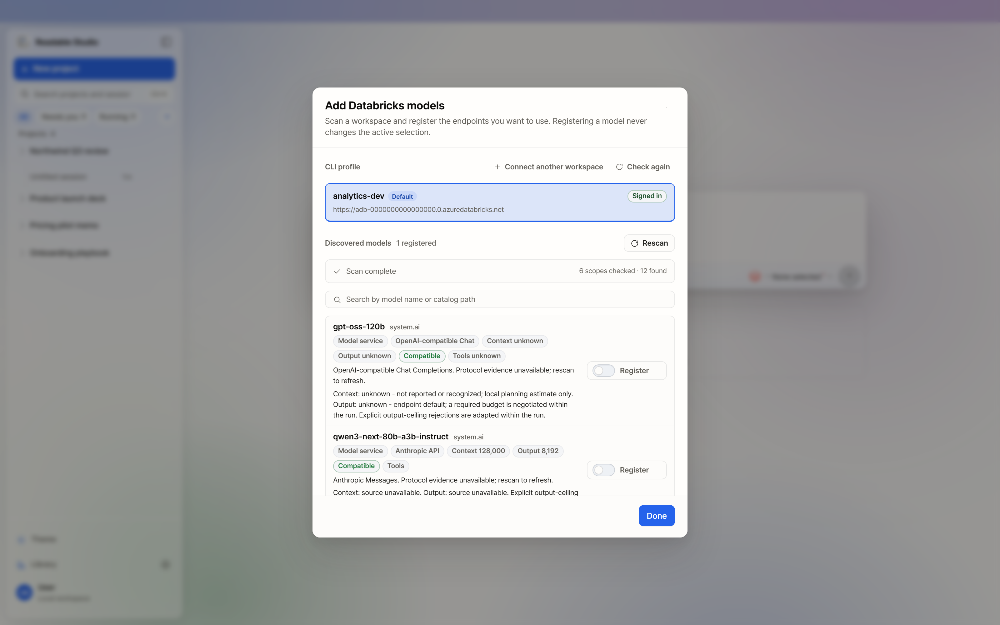

<h1 align="center">Readable Studio</h1>

<p align="center"><strong>Turn source text into polished standalone HTML, then edit it like a slide.</strong></p>

<p align="center">
  <a href="https://github.com/sanghyunna/readable-studio/releases/latest"></a>
  
  <a href="LICENSE"></a>
</p>

<p align="center">
  <a href="https://github.com/sanghyunna/readable-studio/releases/latest"><strong>Download for Windows 10/11 x64 — portable ZIP</strong></a>
  ·
  <a href="#download-and-run">How to run</a>
</p>

<p align="center">Extract the ZIP and run <code>Readable Studio.exe</code>. No installer.</p>

<p align="center">
  <picture>
    <source media="(prefers-color-scheme: dark)" srcset="docs/assets/readme/hub-dark.png">
    
  </picture>
</p>

<p align="center"><sub>Releases: https://github.com/sanghyunna/readable-studio/releases/latest</sub></p>

## Why Readable Studio

AI writes a good first draft. Then the heading is two words too long, a card belongs higher up, and a colour is off. Prompting again for each of those is slow, and the next draft moves things you had already accepted.

Readable Studio splits the work. An installed coding agent drafts the document from **your** source material. You then fix the details by clicking them in the rendered page, the way you would in PowerPoint. The finished document is one standalone HTML file that opens anywhere.

## Download and run

1. Open [Releases](https://github.com/sanghyunna/readable-studio/releases/latest) and download `Readable-Studio-win-x64-portable.zip`.
2. Extract the **whole** archive to a writable folder such as `Readable Studio` (the ZIP has no enclosing folder). Don't run it from inside the ZIP viewer.
3. Run `Readable Studio.exe`.

Windows 10/11 x64 only. The machine needs no Node.js, pnpm, or Git. Windows may show a SmartScreen warning for an unsigned build. When you move the app, move the `ReadableStudioData` folder with it — projects, settings, logs, and cache live there.

For local-agent mode you need an installed, authenticated coding-agent CLI. Codex and Cursor Agent are scanned by default; other adapters can be enabled in Settings. You can also use bring-your-own-key execution instead.

## From source text to finished HTML

```text
Source Text  ->  AI Generation  ->  Direct Editing  ->  Standalone HTML
```

1. **Source text.** Paste the brief, report, or notes, or import a folder of approved material. The document is grounded in what you supply.
2. **AI generation.** Pick a plugin, skill, and design system. Readable Studio composes them with your source and dispatches an installed local agent.
3. **Direct editing.** Select any element in the preview and change it in place. Every edit writes back to the HTML source.
4. **Standalone HTML.** Export one file that opens anywhere.

<p align="center">
  
</p>

## Edit what you see

<p align="center">
  
</p>

Click a headline and the inspector opens beside it. Drag the handles to resize, or nudge with the keyboard. Without writing a prompt you can change text and rich-text selections, links and images, typography, spacing and the box model, position and size, colours and design tokens, attributes and the element's own HTML — plus duplicate, move, remove, undo, and redo.

Direct editing sits beside the agent, not in place of it. Use the inspector for mechanical fixes, and prompts for substantive revisions.

## A readable run log

<p align="center">
  
</p>

A turn shows what you need to judge it: the files it produced, its reasoning when the agent emits it, and one summary row per burst of tool calls. Runtime chatter stays out of the log; a failed run still says so.

## Tour

| Pick an agent | Pick a model |
| :---: | :---: |
|  |  |

**Themes.** Twelve built-in themes plus follow-system, from Light and Dark to Catppuccin, Nord, Gruvbox, Dracula, and Solarized.



**Your own endpoints.** Register a Databricks workspace and pick from the models it serves. Unity Catalog names show the model first and the `catalog.schema` path beside it, and the list is searchable.



## Export and portability

Standalone HTML is the canonical output. Other formats depend on the artifact:

| Artifact | Exports |
| --- | --- |
| HTML document | standalone HTML, PDF, ZIP |
| Slide deck | standalone HTML, PDF, PPTX, ZIP |
| Markdown document | Markdown, HTML, PDF, ZIP |
| SVG | SVG, ZIP |

The HTML exporter inlines statically discoverable local dependencies. External URLs and missing local files stay in place and are reported as warnings rather than hidden. It doesn't crawl websites or capture runtime network traffic.

## Every capability from the command line

The UI and the `readable` CLI talk to the same local daemon through the same `/api/*` contracts, so every capability in the UI has a subcommand. Machine-consumed commands support `--json`; commands that take a prompt accept `--prompt-file <path|->`.

```powershell
readable project create --name "Quarterly review" --json
readable files list --project <project-id> --json
readable plugin apply <plugin-id> --project <project-id> --input brief="..."
readable export html --project <project-id> --file index.html --output .\quarterly-review.html --json
```

Subcommands also cover `run`, `conversation`, `artifacts`, `skills`, `templates`, `automation`, `research`, `memory`, `mcp`, `ui`, `agent`, `provider`, `fonts`, `doctor`, and more. Run `readable --help` for the full set.

Plugins are portable workflow folders: `SKILL.md` for the agent, plus an optional `readable-studio.json` for typed inputs, capabilities, stages, and references. See [`docs/plugins-spec.md`](docs/plugins-spec.md).

## Where your data lives

| Mode | Location |
| --- | --- |
| Portable app | `<exeDir>\ReadableStudioData\namespaces\<namespace>\...` |
| Source checkout | `<repo>\.readable-studio\...` |
| Override | absolute path in `READABLE_DATA_DIR` |

## For contributors

Start with [`QUICKSTART.md`](QUICKSTART.md), [`CONTRIBUTING.md`](CONTRIBUTING.md), [`docs/architecture.md`](docs/architecture.md), and [`docs/spec.md`](docs/spec.md). English and Korean are the maintained product languages; see [`TRANSLATIONS.md`](TRANSLATIONS.md).

<details>
<summary>Build from source on Windows</summary>

Requirements: Windows 10/11 x64, Node `~24`, pnpm `10.33.2`, Visual Studio Build Tools 2022 or newer, and Python 3 for the native `better-sqlite3` build.

```powershell
git clone https://github.com/sanghyunna/readable-studio.git
cd readable-studio
npm install -g pnpm@10.33.2
pnpm install
pnpm tools-dev
```

`pnpm tools-dev` is the only root lifecycle command; there is no root `pnpm dev`, `start`, `build`, or `test`. Use `pnpm tools-dev status --json`, `logs --json`, `stop`, and `check` to control the workspace. Before opening a PR, run `pnpm guard` and `pnpm typecheck`.

Build the portable ZIP from the repository root:

```powershell
powershell -ExecutionPolicy Bypass -File .\build-portable.ps1
```

Maintainers can build, start, inspect, and tear down a local portable build with `pnpm tools-pack win <build|start|inspect|logs|stop|cleanup>`. These are local controls; the repository has no release-publishing workflow.

```text
Windows desktop shell
        |
        v
Next.js web UI  <---- /api/* + SSE ---->  local daemon  ----> enabled agent CLI
     |                                      |
     |                                      +---- plugins / skills / design systems
     v                                      +---- .readable-studio data
sandboxed preview + direct-edit bridge
     |
     +---- standalone HTML (canonical)
     +---- PDF / PPTX / ZIP / Markdown (artifact-dependent)
```

</details>

## License

Apache-2.0. See [`LICENSE`](LICENSE).
